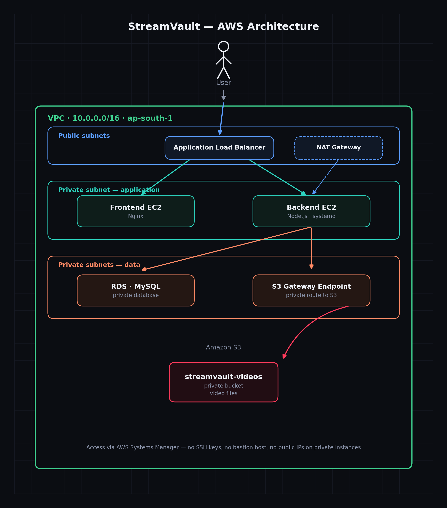

# StreamVault

A private video streaming web app — users log in, browse a video library, and stream videos with full seek/scrub support. Built on AWS with a security-first infrastructure design.

## Architecture



Traffic flows through a single public entry point (Application Load Balancer) with path-based routing, into private-subnet application servers, backed by a private database and private object storage. No component other than the load balancer is reachable from the internet.

## Infrastructure

- **Networking:** VPC with public and private subnets across 2 Availability Zones, NAT Gateway for outbound-only internet access from private instances
- **Compute:** EC2 instances for frontend (Nginx) and backend (Node.js), both in private subnets with no public IPs
- **Routing:** Application Load Balancer — `/api/*` routes to the backend, everything else to the frontend
- **Database:** RDS (MySQL), private subnet, reachable only from the application tier
- **Storage:** S3 (private bucket) for video files, accessed via an IAM role — no hardcoded credentials
- **Access:** AWS Systems Manager Session Manager for instance access — no SSH keys, no bastion host, no open management ports
- **Reliability:** Backend runs as a `systemd` service — auto-restarts on crash, survives session disconnects and reboots

## Security

- Layered security groups: internet → ALB only → app tier only → database tier only
- No public IPs on any instance except the load balancer
- Passwords hashed with bcrypt; sessions authenticated with JWT
- IAM least-privilege roles per instance (backend has S3 read access; nothing else does)

## Features

- JWT-based authentication
- Protected video listing and streaming endpoints
- HTTP range-request support for video seeking/scrubbing
- Responsive login and dashboard UI

## Tech stack

`AWS VPC` · `EC2` · `RDS (MySQL)` · `S3` · `Application Load Balancer` · `IAM` · `Systems Manager` · `Node.js` · `Express` · `Nginx` · `JWT` · `bcrypt`

## Project structure

```
.
├── backend/          # Node.js/Express API, MySQL + S3 integration
├── frontend/         # Static login + video dashboard UI
└── assets/           # Architecture diagram
```
